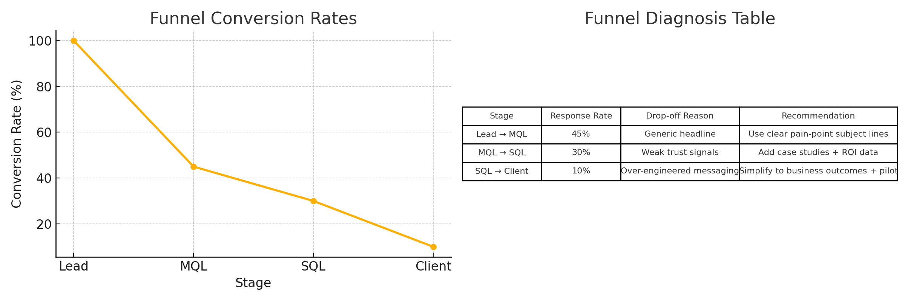

# DT Fellowship Option 2 – Growth Analyst Submission

This repository contains my submission for **DT Fellowship Simulation Assignment (Option 2: Growth Analyst – Mass Personalized Messaging)**.

## Files Included

- **DT_Fellowship_Option2_Assignment.docx** → Full written assignment (Parts 1–4).  
- **DT_Fellowship_Option2_Assignment.pdf** → PDF version of the assignment.  
- **DT_Fellowship_Option2_Dashboard_Final.xlsx** → Dashboard with metrics, AIDCA diagnosis, and recommendations.  
- **DT_Fellowship_Option2_Dashboard.csv** → Clean CSV version of the dashboard data.  
- **Funnel_Chart.png** → Visual representation of funnel conversion rates.  
- **Dashboard_Screenshot.png** → Combined view of funnel chart + diagnosis table.  

## Visuals Preview

### Funnel Chart

### Dashboard Screenshot

## How to Use

1. Open the Word or PDF file for the complete assignment text.  
2. Review the Excel dashboard (includes Instructions + Dashboard sheets).  
3. Use the CSV file for quick reference or integration into other tools.  
4. Refer to the images above for a quick visual overview without opening Excel.  

---
**Author:** Jonah Chawre  
**Role Applied:** Data Champion  
